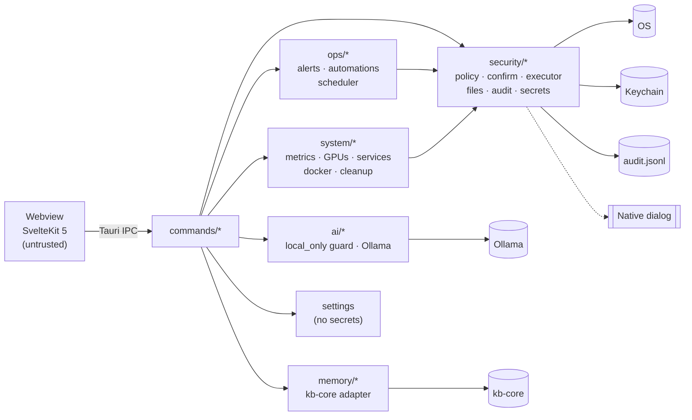

<div align="center">

# 🌌 OMNIX

### A local-first AI desktop assistant

[](LICENSE)
[](https://tauri.app)
[](https://svelte.dev)
[](https://www.rust-lang.org)

**OMNIX** is a desktop assistant built with Tauri 2, SvelteKit and Rust. It talks to a local LLM (Ollama) and can run commands on your machine, but only through a policy engine, native approval dialogs and a tamper-evident audit log.


</div>

---

## What works today

| Area | Status |
|------|--------|
| Streaming chat with Ollama (local), rendered as sanitized Markdown | ✅ |
| AI tool use: the model can list/read files and run commands, **through the same policy engine and approval dialogs** | ✅ (Ollama models with tool support; others answer without tools) |
| `/execute` shell commands, risk-classified, with native approval for anything that changes the system | ✅ |
| `/file read`, `/file list`, `/file write` (writes need approval, credential files are off-limits) | ✅ |
| Agent file tools: `write_file` (HTML, Markdown, CSV, code) and `create_workbook` (native Excel `.xlsx` with formulas, tables, validation, conditional formats, charts) | ✅ every write confirmed natively and audited |
| `/remember`, `/recall`, `/search`: save and look up memories, search memories + indexed documents | ✅ needs kb-core |
| System Control: live CPU/memory/disk/network/sensors with history, **every GPU (NVIDIA + AMD)** with VRAM, temperature, power and per-process usage; agent metrics (tokens/s, time to first token, tool latency, recall) and model metrics (VRAM split, cold starts) | ✅ |
| Services & Docker: list, start/stop/restart and logs for systemd services and containers (confirmed, audited) | ✅ |
| Alerts, automations and scheduler: metric/service/container/model alerts with desktop notifications; triggers (alert, condition, process, file, idle) → notify / command / AI report; cron schedules; unattended commands need one signed native approval | ✅ |
| Cleanup & Optimize: reclaimable-space scan with confirmed cleanup; measured recommendations with one-click fixes | ✅ |
| Model manager: installed and loaded Ollama models, load/unload, download with progress, delete | ✅ |
| Agent host tools: `host_status`, `host_control`, `create_schedule`, `create_alert` | ✅ every change confirmed natively |
| `/monitor` and process list with ending a process | ✅ |
| Launch at login (Settings → General) | ✅ |
| API keys stored in the OS keychain | ✅ |
| Hash-chained, redacted audit log with a **Verify** button | ✅ |
| Local-only mode (blocks cloud providers and non-local endpoints) | ✅ on by default |
| Settings export/import (never includes secrets) | ✅ |
| Cloud providers (Anthropic, OpenAI, Gemini, xAI) with streaming + tools | ✅ when local-only mode is turned off; keys in the OS keychain |
| Voice: push-to-talk speech input via a faster-whisper server (Speaches), read-aloud via local Piper | ✅ when configured (Settings → Voice); hold or tap the mic, or hold Ctrl+Space; built-in mic test |
| JARVIS-style holographic avatar: 13 mood colours, alert halos (offline, high load, blocked, connection issue), tool-call satellites, in-app colour key | ✅ |
| Long-term memory ([kb-core](kb-core/README.md)): automatic recall before each reply, `remember` tool, optional fact capture, conversation archive, duplicate merging and contradiction handling (local LLM, optionally cross-checked by an NLI model), recall feedback, optional encryption at rest, hybrid keyword + semantic search over memories, notes, PDFs and code in live-synced folders, **knowledge bases**, analytics, export/import, Prometheus metrics | ✅ installed by `bootstrap.sh` / `./scripts/setup-memory.sh` ([contract](docs/kb-core-contract.md)) |
| Google: Gmail (search, read, drafts), Drive (search, read, upload), Google developer docs lookup | ✅ off by default; Settings → Google; needs local-only mode off and your own OAuth client |
| MCP servers (stdio or HTTP) as extra AI tools, every call policy-gated and audited | ✅ Settings → MCP Servers |
| Phone: alerts, rules and reports can **text or call your phone** (Twilio, outbound only, rate-limited, audited) | ✅ off by default; Settings → Phone |
| Tray icon, close-to-tray, single instance, remembered window size | ✅ |
| Optional audit-log shipping to Grafana Loki | ✅ off by default |
| AIORC routing backend | 🚧 scaffold only (`--features aiorc`), awaiting its `.proto` |
| Auto-update | 🚧 not enabled until release signing is configured |
| One-command setup on Ubuntu/Debian (`scripts/bootstrap.sh`) + health check (`scripts/doctor.sh`) | ✅ |

Anything marked planned is visibly disabled in the app and returns a `not_implemented` error from the backend. Nothing pretends to succeed.

---

## Quick start

### One command (Ubuntu / Debian, recommended)

```bash
git clone https://github.com/paulmmoore3416/omnix-ai-desktop.git
cd omnix-ai-desktop
./scripts/bootstrap.sh
```

`bootstrap.sh` is idempotent (safe to re-run) and sets up everything:

1. System packages (WebKitGTK/Tauri build deps, audio, jq, Python venv), Rust stable, Node.js 24
2. Ollama as a systemd service, plus chat models (`qwen3:8b` default, `qwen3:14b` extra)
3. [Speaches](https://github.com/speaches-ai/speaches) speech-to-text in Docker on the smallest NVIDIA GPU (CUDA image), with the model downloaded
4. Piper text-to-speech in a private venv, plus the `en_US-lessac-medium` voice
5. `~/.config/omnix/settings.json` seeded with those endpoints (it fills blanks and never overwrites your choices; a backup is kept)
6. A release build of OMNIX, installed as a `.deb` (app launcher + `omnix` command)
7. `scripts/doctor.sh` health check (Ollama round-trip, STT model, Piper voice, settings, GPUs)

Options: `--services-only`, `--no-services`, `--lan` (serve Ollama/Speaches to other machines), `--cpu`, `--yes`.
The NVIDIA driver is the one thing it won't install; it stops and tells you the command. Full server notes, GPU
layout and troubleshooting: **[docs/SERVER_DEPLOYMENT.md](docs/SERVER_DEPLOYMENT.md)**.

Running Claude Code on the target machine? Point it at **[CLAUDE.md](CLAUDE.md)**: it's the step-by-step runbook
for installing, verifying and fixing OMNIX.

### Manual / other platforms

- Node.js 24 LTS (22+ works) and npm
- Rust (stable, 1.95+) via [rustup](https://rustup.rs)
- Platform dependencies for Tauri: see the [Tauri prerequisites](https://v2.tauri.app/start/prerequisites/)
  - Linux: `libwebkit2gtk-4.1-dev build-essential curl wget file libssl-dev libayatana-appindicator3-dev librsvg2-dev libxdo-dev`, a polkit agent (for `pkexec`), and a Secret Service provider (GNOME Keyring or KWallet) for key storage
  - macOS / Windows: `scripts/setup.sh` / `scripts/setup.ps1` check the toolchain and install npm dependencies
- [Ollama](https://ollama.com) with at least one model pulled (`ollama pull qwen3:8b`)

```bash
npm ci
npm run tauri dev        # development
npm run tauri build      # production bundle
```

### Configure

All configuration is done in the app under **Settings** and stored in:

- `settings.json` in your config directory (`~/.config/omnix/` on Linux). It contains **no secrets**.
- The **OS keychain** for API keys (write-only from the UI: "Key saved ✓ / Replace / Remove").

`.env` files are **not** read by the app. `.env.example` only documents developer tooling variables.

Open **Settings → AI Models** and pick a model from the list (OMNIX reads the installed models from Ollama's
`/api/tags`; no model is hardcoded). Voice setup is in **Settings → Voice** ([guide](docs/USER_GUIDE.md#4-talking-to-omnix-voice)).

---

## Usage

New to OMNIX? Start with the **[User Guide](docs/USER_GUIDE.md)**. For a full capability breakdown (and what makes OMNIX different) see the **[Project Overview](docs/PROJECT_OVERVIEW.md)**; for every command, setting, event and algorithm see the **[Technical Reference](docs/TECHNICAL_REFERENCE.md)**. The memory engine is documented in **[kb-core/README.md](kb-core/README.md)**.

```text
/execute git status                 # read-only: runs immediately
/execute npm install                # mutating: native approval dialog first
/file read ~/notes/todo.md
/file list ~/projects
/file write ~/notes/new.md Hello    # approval dialog
/monitor
/remember I prefer metric units #prefs
/recall units                       # memories only; no query = most recent
/search zfs backup                  # memories + indexed notes and documents
```

Anything that doesn't start with `/` goes to the configured model. Responses stream in the **Conversation** view. The model may use tools (list/read files, run commands, search and save memories), and anything that would change your system still opens an approval dialog labelled *proposed by the AI assistant*. By default it gets one round of tool calls per message; **Settings → Security → autonomous mode** raises that (off by default).

---

## 🔒 Security

OMNIX is designed on the assumption that the webview **and** the LLM may be compromised or manipulated. The Rust backend is the trust boundary. See [`docs/SECURITY.md`](docs/SECURITY.md) for the full threat model.

**Command execution**

- The frontend cannot run shell commands directly. The single entry point (`request_execution`, also used by `/execute`) runs every command through a policy engine that parses it with shell-quoting awareness and classifies it:

  | Tier | Examples | Behaviour |
  |------|----------|-----------|
  | **Read-only** | `ls`, `cat`, `git status`, `ps`, `df` | Runs (optionally confirmed) |
  | **Mutating** | writes, installs, `git commit`, service changes, anything using `;` `&&` `\|` `$(…)` redirects or globs, unknown programs | Native approval dialog |
  | **Privileged** | `sudo …`, `pkexec …` | Requires **Settings → Security → Allow privileged commands** (off by default) plus approval; elevation goes through the OS password prompt (pkexec / macOS admin prompt / UAC), and OMNIX never handles passwords |
  | **Denied** | `rm -rf /` (and quoting, path-prefix, variable and Unicode variants), `mkfs`, raw disk writes, fork bombs, `chmod -R 777 /`, `curl … \| sh`, reading `~/.ssh`, `/etc/shadow`, cloud credentials | Never runs; cannot be overridden |

- Approval dialogs are **native** (raised from Rust), show the exact command, working directory and risk tier, default to **deny**, and time out as deny.
- Child processes get a cleared environment (`PATH`, `HOME`, `LANG`, `TERM` only), a timeout (default 60 s), a 1 MiB output cap, and are killed with their whole process group on timeout.
- You can add your own blocked prefixes, or switch to allowlist mode.

**Audit log.** Every execution, file access, process kill, secret change and security-setting change is appended to `audit.jsonl` in the app log directory (`~/.local/share/com.paulmmoore.omnix/logs/` on Linux). Each line carries the SHA-256 of the previous line, so edits and deletions are detectable (**Settings → Security → Verify audit log**). API keys and bearer tokens are redacted before writing.

**Secrets.** Provider keys live only in the OS keychain. No IPC command returns a secret to the UI. Keys found in older plaintext `settings.json` files are migrated to the keychain automatically and removed from the file.

**Local-only mode (default: on).** Hard-blocks cloud AI providers and any endpoint that doesn't resolve to loopback, RFC 1918, link-local, CGNAT/Tailscale (`100.64.0.0/10`) or IPv6 ULA addresses. This is enforced in Rust, not the UI. **Keep it on for machines on healthcare networks**: it prevents prompts that may contain PHI from leaving the local network. Turning it off requires a native confirmation.

**Webview hardening.** Strict Content-Security-Policy (no remote origins; all network access goes through Rust). No shell, filesystem, opener, dialog, notification or clipboard plugin permissions are granted to the webview. Devtools only open in debug builds.

**MCP, voice and log shipping** follow the same rules: registering servers or endpoints needs native confirmation, every MCP tool call is confirmed (unless you mark it read-only) and audited, endpoints obey local-only mode, and the microphone is push-to-talk only.

**No telemetry.** OMNIX sends nothing anywhere except to endpoints you configure.

---

## Architecture



The Rust backend is the trust boundary; the webview can only call registered commands. Details, sequence diagrams and design decisions: [`docs/ARCHITECTURE.md`](docs/ARCHITECTURE.md).

## Development

```bash
npm run check                     # svelte-check
npm test                          # Vitest
(cd kb-core && python3 -m unittest discover -s tests -t .)   # kb-core
./scripts/doctor.sh               # environment health check
cd src-tauri && cargo test        # Rust unit tests
cargo clippy --all-targets -- -D warnings
```

## Technology

- **Frontend:** SvelteKit 5, TypeScript, Tailwind CSS
- **Backend:** Tauri 2, Rust (tokio, reqwest, sysinfo, keyring, tracing)
- **AI:** Ollama (local), Anthropic Messages API, OpenAI-compatible APIs; custom agent loop (no framework)
- **Memory:** [kb-core](kb-core/README.md): Python standard library (numpy optional), SQLite FTS5, Ollama embeddings

---

## Contributing

See [CONTRIBUTING.md](CONTRIBUTING.md).

```bash
git checkout -b feature/my-change
./scripts/doctor.sh               # sanity-check your environment
```

## License

MIT, see [LICENSE](LICENSE).

## Support

- Bugs and feature requests: [GitHub Issues](https://github.com/paulmmoore3416/omnix-ai-desktop/issues)
- Security issues: see [`docs/SECURITY.md`](docs/SECURITY.md) (please report privately)
