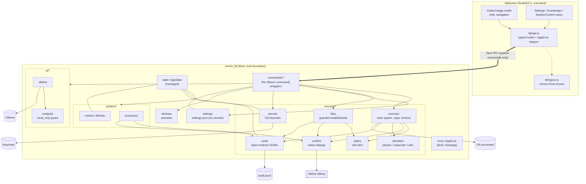
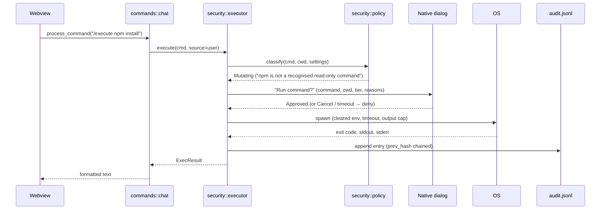

# OMNIX Architecture

OMNIX is a Tauri 2 application: a SvelteKit 5 single-page frontend rendered
in the system webview, and a Rust backend (`omnix_lib`) that owns every
privileged capability. The frontend talks to the backend only through
explicitly registered `#[tauri::command]` functions.

## Module map



## Request flow: `/execute npm install`



## Key decisions

| Decision | Why |
|----------|-----|
| All privileged work in Rust; no shell/fs plugins in the webview | The webview is treated as compromised-by-default. |
| Native (Rust) confirmation dialogs | JS `confirm()` can be bypassed by the code it is meant to guard. |
| Structured `AppError { kind, message }` | UI can branch on `not_implemented`, `policy_denied`, etc., without string parsing. |
| Settings on disk contain no secrets | Keys live in the OS keychain; settings files are safe to back up/export. |
| `NotImplemented` instead of fake success | Honest UI: unimplemented controls are disabled, never "succeed". |
| Tauri managed state instead of globals | Testable, explicit lifetimes, no hidden initialization order. |
| One shared `reqwest::Client` | Connection pooling and consistent timeouts. |

## Directory layout

```
src/                         SvelteKit frontend
  lib/api.ts                 typed invoke wrapper, NOT_IMPLEMENTED set
  lib/types.ts               TypeScript mirrors of Rust IPC types
  lib/components/            views + SecretField
  routes/+page.svelte        shell, chat, navigation
src-tauri/
  src/lib.rs                 builder, plugins, command registration
  src/main.rs                calls omnix_lib::run()
  src/commands/              IPC surface
  src/security/              policy, confirm, executor, elevation, files, audit, secrets
  src/ai/                    endpoint guard, providers
  src/system/                metrics, processes
  src/settings.rs            persisted configuration
  src/state.rs               AppState
  capabilities/default.json  least-privilege webview permissions
  tauri.conf.json            CSP, bundle config
docs/                        SECURITY.md, ARCHITECTURE.md
```

## Testing

* **Rust:** `cd src-tauri && cargo test`. Policy engine (tiers + bypass
  attempts), audit chain verification and redaction, secret migration,
  settings load/save/migration, executor (capture, truncation, timeout,
  env clearing), endpoint guard, metrics.
* **Frontend:** `npm test` (Vitest + @testing-library/svelte in jsdom), with
  `@tauri-apps/api/core` mocked.
* **Types:** `npm run check` (svelte-check).
* **CI:** `.github/workflows/ci.yml` runs all of the above plus `cargo fmt`,
  `cargo clippy -D warnings`, `cargo audit`, `npm audit`, a secret scan and a
  three-OS compile.

## Releases and signing

`.github/workflows/release.yml` builds installers for Linux, macOS (universal)
and Windows when a `v*` tag is pushed, and attaches them to a **draft**
release. Without signing secrets the builds are unsigned. To sign:

* **macOS:** add `APPLE_CERTIFICATE` (base64 .p12), `APPLE_CERTIFICATE_PASSWORD`,
  `APPLE_SIGNING_IDENTITY`, and for notarization `APPLE_ID`, `APPLE_PASSWORD`
  (app-specific), `APPLE_TEAM_ID` as repository secrets, then uncomment them in
  the workflow.
* **Windows:** configure `bundle.windows.certificateThumbprint` (or a
  `signCommand` for cloud HSMs such as Azure Trusted Signing) in
  `tauri.conf.json`.
* **Linux:** AppImage/deb are unsigned by convention; publish checksums.

No certificates or private keys are committed to the repository.
