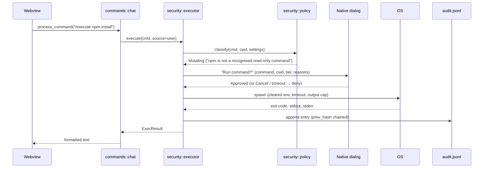
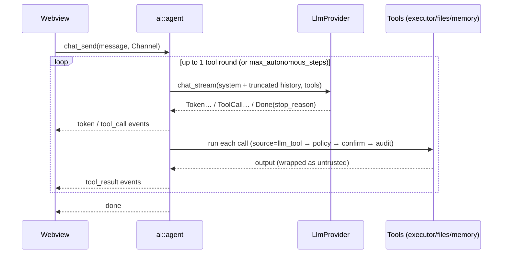
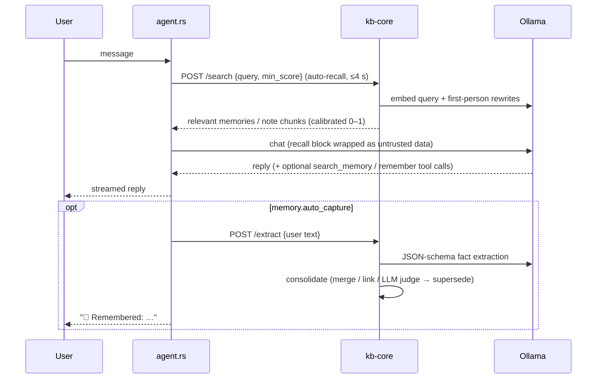

# OMNIX Architecture

OMNIX is a Tauri 2 application: a SvelteKit 5 single-page frontend rendered
in the system webview, and a Rust backend (`omnix_lib`) that owns every
privileged capability. The frontend talks to the backend only through
explicitly registered `#[tauri::command]` functions.

## Module map

```mermaid
flowchart TB
    subgraph Webview["Webview (SvelteKit 5, untrusted)"]
        page["routes/+page.svelte<br/>chat, navigation"]
        views["Settings / Knowledge / SystemControl views"]
        api["lib/api.ts<br/>typed invoke + AppError helpers"]
        types["lib/types.ts<br/>mirrors Rust structs"]
        page --> api
        views --> api
        api -.-> types
    end

    api == "Tauri IPC (custom commands only)" ==> commands

    subgraph Rust["omnix_lib (Rust, trust boundary)"]
        commands["commands/*<br/>thin #[tauri::command] wrappers"]
        state["state::AppState<br/>(managed)"]
        error["error::AppError<br/>{kind, message}"]

        subgraph security["security/*"]
            policy["policy<br/>risk tiers"]
            confirm["confirm<br/>native dialogs"]
            executor["executor<br/>tokio spawn, caps, timeout"]
            elevation["elevation<br/>pkexec / osascript / UAC"]
            files["files<br/>guarded read/list/write"]
            audit["audit<br/>hash-chained JSONL"]
            secrets["secrets<br/>OS keychain"]
        end

        subgraph ai["ai/*"]
            agent["agent<br/>tool loop, untrusted wrapping"]
            tasks["tasks<br/>tool-less side tasks"]
            providerT["provider<br/>LlmProvider trait"]
            ollama["ollama<br/>/api/chat NDJSON"]
            anthropic["anthropic<br/>Messages SSE"]
            openai["openai_compat<br/>OpenAI / xAI / Gemini"]
            endpoint["endpoint<br/>local_only guard"]
            ctx["context<br/>truncation"]
            admin["ollama_admin<br/>model manager"]
            aimetrics["metrics<br/>agent/model metrics"]
        end

        subgraph memory["memory/*"]
            store["MemoryStore trait"]
            kbcore["kb_core<br/>REST adapter"]
        end

        subgraph system["system/*"]
            metrics["metrics::Monitor<br/>+ gpu, history"]
            processes["processes"]
            probe["probe<br/>fixed-argv reads"]
            hostctl["services, docker,<br/>cleanup, advisor"]
        end

        subgraph ops["ops/*"]
            engine["engine<br/>alerts, automations, scheduler"]
            approval["approval<br/>HMAC pre-approval"]
        end

        settings["settings<br/>settings.json (no secrets)"]
        desktop["desktop<br/>autostart, tray, PTT shortcut, mic"]
        mcp["mcp<br/>rmcp client"]
        voice["voice<br/>STT + Piper TTS"]
        obs["observability<br/>Loki shipper"]

        commands --> executor
        commands --> files
        commands --> settings
        commands --> secrets
        commands --> ai
        commands --> system
        commands --> desktop
        commands --> ops
        commands --> admin
        hostctl --> executor
        hostctl --> probe
        engine --> metrics
        engine --> approval
        engine --> executor
        agent --> aimetrics
        executor --> policy
        executor --> confirm
        executor --> elevation
        executor --> audit
        files --> policy
        files --> confirm
        files --> audit
        processes --> confirm
        processes --> audit
        agent --> providerT
        providerT --> ollama
        providerT --> anthropic
        providerT --> openai
        agent --> ctx
        agent --> executor
        agent --> files
        agent --> store
        agent --> mcp
        commands --> voice
        voice --> executor
        mcp --> policy
        mcp --> confirm
        mcp --> audit
        audit --> obs
        store --> kbcore
        ollama --> endpoint
        kbcore --> endpoint
        state --- settings
        state --- audit
        state --- secrets
        state --- metrics
    end

    executor --> OS[(OS processes)]
    secrets --> KC[(Keychain)]
    audit --> LOG[(audit.jsonl)]
    ollama --> OL[(Ollama)]
    anthropic --> CLOUD[(Cloud APIs<br/>blocked when local_only)]
    openai --> CLOUD
    kbcore --> KB[(kb-core)]
    confirm --> DLG[[Native dialog]]
```



## Request flow: `/execute npm install`



## Chat flow (streaming + tools)



## Key decisions

| Decision | Why |
|----------|-----|
| All privileged work in Rust; no shell/fs plugins in the webview | The webview is treated as compromised-by-default. |
| Native (Rust) confirmation dialogs | JS `confirm()` can be bypassed by the code it is meant to guard. |
| Structured `AppError { kind, message }` | UI can branch on `not_implemented`, `policy_denied`, etc., without string parsing. |
| Settings on disk contain no secrets | Keys live in the OS keychain; settings files are safe to back up/export. |
| `NotImplemented` instead of fake success | Honest UI: unimplemented controls are disabled, never "succeed". |
| Tauri managed state instead of globals | Testable, explicit lifetimes, no hidden initialization order. |
| One shared `reqwest::Client` | Connection pooling and consistent timeouts. |
| Own agent loop on a small `LlmProvider` trait | Every tool call must pass the policy engine; a framework would hide that seam. |
| Streaming over Tauri `Channel` | Ordered, per-request event delivery without global event names. |
| Model ids discovered at runtime | Providers add/retire models; hardcoded ids go stale. |

## Directory layout

```
src/                         SvelteKit frontend
  lib/api.ts                 typed invoke wrapper, NOT_IMPLEMENTED set
  lib/types.ts               TypeScript mirrors of Rust IPC types
  lib/components/            views + SecretField
  routes/+page.svelte        shell, chat, navigation
src-tauri/
  src/lib.rs                 builder, plugins, command registration
  src/main.rs                calls omnix_lib::run()
  src/commands/              IPC surface
  src/security/              policy, confirm, executor, elevation, files, audit, secrets
  src/ai/                    providers, agent loop, context, endpoint guard
  src/memory/                MemoryStore trait (core + optional extensions) + kb-core adapter
  src/mcp.rs                 MCP client (stdio + streamable HTTP), policy-gated tool calls
  src/voice.rs               faster-whisper STT client, Piper TTS
  src/observability.rs       optional Loki audit shipping
  src/desktop.rs             autostart, tray, global shortcut, microphone permissions
  tests/fixtures/            tiny MCP stdio server used by tests
  src/system/                metrics, GPUs, history, probes, processes, services, docker, cleanup, advisor, snapshot
  src/ops/                   alerts, automations, scheduler (engine, rules, cron, HMAC approvals)
  src/settings.rs            persisted configuration
  src/state.rs               AppState
  capabilities/default.json  least-privilege webview permissions
  tauri.conf.json            CSP, bundle config
kb-core/                     local long-term memory service (Python; see kb-core/README.md)
  kb_core/store.py           engine: SQLite + FTS5 + vector index, hybrid search, consolidation
  kb_core/server.py          HTTP API + browser/CSRF guards
  kb_core/sync.py            live folder sync
  tests/                     offline unit tests
scripts/                     bootstrap.sh, doctor.sh, setup-memory.sh
docs/                        SECURITY.md, ARCHITECTURE.md, TECHNICAL_REFERENCE.md, USER_GUIDE.md,
                             SERVER_DEPLOYMENT.md, PROJECT_OVERVIEW.md, kb-core-contract.md, articles/
```

## Long-term memory flow



## Testing

* **Rust:** `cd src-tauri && cargo test`. Policy engine (tiers + bypass
  attempts), audit chain verification and redaction, secret migration,
  settings load/save/migration, executor (capture, truncation, timeout,
  env clearing), endpoint guard, metrics.
* **Frontend:** `npm test` (Vitest + @testing-library/svelte in jsdom), with
  `@tauri-apps/api/core` mocked.
* **Types:** `npm run check` (svelte-check).
* **CI:** `.github/workflows/ci.yml` runs all of the above plus `cargo fmt`,
  `cargo clippy -D warnings`, `cargo audit`, `npm audit`, a secret scan and a
  three-OS compile.

## Desktop plugins

| Plugin | Purpose |
|--------|---------|
| `single-instance` | A second launch focuses the running window |
| `window-state` | Restores window size/position |
| `global-shortcut` | Ctrl+Space push-to-talk (emits `ptt` pressed/released) |
| `autostart` | Launch at login from `general.auto_start` |
| `log` | Rotating `omnix.log` (separate from the audit log) |
| `dialog` | Native confirmations and file pickers (Rust-side only) |
| `notification` | Desktop notifications for alerts and automations (Rust-side only) |
| tray (`tauri` `tray-icon`) | Show/Quit menu; close-to-tray when `general.minimize_to_tray` |

None of these grant permissions to the webview except core event listening
(for `ptt`).

## Updater (not enabled)

`tauri-plugin-updater` is intentionally **not** registered: shipping update
checks without signed artifacts would let anyone who can tamper with the
update feed replace the app. To enable it:

1. `npm run tauri signer generate -- -w ~/.tauri/omnix.key` (keep the private
   key out of the repo; store it and its password as the
   `TAURI_SIGNING_PRIVATE_KEY` / `TAURI_SIGNING_PRIVATE_KEY_PASSWORD` secrets).
2. Add `tauri-plugin-updater` (Rust + `@tauri-apps/plugin-updater`) and register it.
3. In `tauri.conf.json`: `"bundle": { "createUpdaterArtifacts": true }` and
   `"plugins": { "updater": { "pubkey": "<public key>", "endpoints": ["https://github.com/paulmmoore3416/omnix-ai-desktop/releases/latest/download/latest.json"] } }`.
4. Grant only `updater:default` in the capability and uncomment the signing
   env vars in `release.yml` (tauri-action then publishes `latest.json`).
5. Respect `general.check_updates` before checking.

## Releases and signing

`.github/workflows/release.yml` builds installers for Linux, macOS (universal)
and Windows when a `v*` tag is pushed, and attaches them to a **draft**
release. Without signing secrets the builds are unsigned. To sign:

* **macOS:** add `APPLE_CERTIFICATE` (base64 .p12), `APPLE_CERTIFICATE_PASSWORD`,
  `APPLE_SIGNING_IDENTITY`, and for notarization `APPLE_ID`, `APPLE_PASSWORD`
  (app-specific), `APPLE_TEAM_ID` as repository secrets, then uncomment them in
  the workflow.
* **Windows:** configure `bundle.windows.certificateThumbprint` (or a
  `signCommand` for cloud HSMs such as Azure Trusted Signing) in
  `tauri.conf.json`.
* **Linux:** AppImage/deb are unsigned by convention; publish checksums.

No certificates or private keys are committed to the repository.
