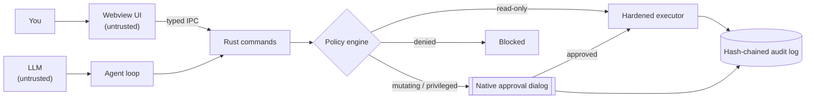

# OMNIX: Project Overview

**A local-first AI desktop assistant that can actually operate your computer, safely.**

| | |
|---|---|
| **Type** | Cross-platform desktop application (Linux, macOS, Windows) |
| **Stack** | Tauri 2 · Rust · SvelteKit 5 (runes) · TypeScript · Tailwind CSS |
| **AI** | Ollama (local, default) · Anthropic · OpenAI-compatible providers · MCP tools |
| **Memory** | kb-core: local long-term memory engine (Python, SQLite FTS5 + vectors, Ollama embeddings) |
| **Codebase** | ~18.8k lines of Rust, ~6.6k lines of TypeScript/Svelte, ~3.2k lines of Python (kb-core) |
| **Quality gates** | 148 Rust tests · 29 Vitest tests · 61 kb-core tests · `clippy -D warnings` · `svelte-check` 0/0 · `cargo audit` / `npm audit` clean |
| **License** | MIT |
| **Author** | Paul Moore, Moore Core Technologies |

---

## 1. The problem

AI assistants that can *do* things on a computer (run commands, read and write files, call tools) are useful and
dangerous in equal measure. Most desktop "AI agents" either:

- **can't act** (chat only), or
- **act with no guardrails**: the model's output goes straight to a shell, secrets sit in plaintext config files, and
  prompts quietly leave the network for a cloud API.

That's unacceptable on machines that handle sensitive data, such as the healthcare, EHS, and enterprise environments
this project was built for.

## 2. The approach

OMNIX treats **both the UI and the AI model as untrusted**. The Rust backend is the only trust boundary:

Every action, whether you typed it or the model proposed it, passes the **same** policy engine, the **same** native
approval dialog, and lands in the **same** tamper-evident audit log.

---

## 3. Capabilities

### 3.1 Conversational AI
- **Streaming chat** rendered as sanitized Markdown (`marked` + DOMPurify; links neutralized).
- **Provider-neutral LLM layer**: Ollama (NDJSON streaming), Anthropic Messages API (SSE over raw HTTP), and any
  OpenAI-compatible API. Models are **discovered at runtime**; none are hardcoded.
- **Custom agent loop** (no framework): the model can list/read files, run commands, search memory and save
  memories. Tool output is
  delimited and escaped as untrusted data to blunt prompt injection. Autonomy is bounded (one tool round per message
  by default, configurable).
- **Stop** and **Clear** controls; per-message tool activity notes (requested / succeeded / failed).

### 3.2 System operation
- `/execute`: shell commands, classified before they run.
- `/file read | list | write`: file access with credential files off-limits; writes need approval.
- `/monitor` and the **System Control** view: live CPU, per-core, memory, swap, disks, network interfaces and sensors
  with an hour of history; **every GPU**, NVIDIA via `nvidia-smi` and AMD via `amdgpu` sysfs, with load, VRAM,
  temperature, power, clocks and per-process VRAM; agent metrics (replies, tokens/s, time to first token, tool latency
  and failures, recall) and model metrics (loaded models, VRAM/RAM split, cold starts).
- **Services & Docker**: systemd units (system + user) and containers: list, start/stop/restart, logs. Every change
  goes through the executor's policy and native dialog; system units also ask polkit.
- **Alerts, automations, scheduler**: alerts on metrics, services, containers, Ollama and kb-core; triggers (alert,
  condition, process start/stop, file change, idle) and cron schedules run a notification, a command or an AI report.
  Unattended commands need a one-time native approval bound by HMAC to the exact command; privileged commands never
  run unattended.
- **Cleanup & Optimize** (allowlisted cache cleanup with one confirmation; measured recommendations with guarded
  one-click fixes) and a **model manager** (load, unload, download with progress, delete).
- Agent **host tools**: `host_status`, `host_control`, `create_schedule`, `create_alert`.

### 3.3 Command policy engine (Rust)
- Quote-aware lexer + `shlex` argv parsing; recursively unwraps `sudo`, `env`, `sh -c`, `eval`, `xargs`,
  `find -exec`, and command substitution.
- Four tiers: **Read-only** (runs) · **Mutating** (native approval) · **Privileged** (opt-in + approval + OS password
  prompt via pkexec / macOS admin / UAC) · **Denied** (never runs).
- Built-in, non-overridable denials: recursive root deletes (including quoting, path-prefix, variable, and Unicode
  look-alike variants), `mkfs`, raw disk writes, fork bombs, `curl | sh`, credential reads.
- **Fails closed** on unparseable input, invisible Unicode, dynamic executable names, and excessive nesting.
- User blocklist, or strict allowlist mode. Covered by 32 bypass-focused unit tests.

### 3.4 Hardened execution
- `tokio::process` with a **cleared environment** (`PATH`, `HOME`, `LANG`, `TERM` only), timeout (default 60 s),
  1 MiB output cap, and **process-group kill** on timeout.

### 3.5 Native approvals
- Raised from Rust, not JavaScript (a webview `confirm()` can be skipped by the code it guards).
- Show the exact command, working directory, risk tier, and whether **you or the AI** proposed it.
- **Default deny**, time out as deny, serialized so dialogs can't stack. They also guard security-weakening settings changes.

### 3.6 Audit & observability
- Append-only JSONL audit log; each line carries the SHA-256 of the previous one, so edits and deletions are detectable.
- Secrets and bearer tokens are redacted before writing. One-click **Verify audit log**.
- Optional shipping to **Grafana Loki**; structured `tracing` throughout.

### 3.7 Privacy & secrets
- **Local-only mode (on by default)**: blocks cloud providers and any endpoint that doesn't resolve to loopback,
  RFC 1918, link-local, CGNAT/Tailscale, or IPv6 ULA. Enforced in Rust and designed to keep PHI inside healthcare networks.
- API keys live only in the **OS keychain**; no IPC path returns a secret; legacy plaintext keys are auto-migrated.
- Strict CSP (no remote origins); the webview has no shell, fs, opener, dialog, clipboard, or notification permissions.
- **No telemetry.**

### 3.8 Voice
- **Push-to-talk** by hold, tap-to-toggle, or the global **Ctrl+Space** shortcut. No always-on listening.
- Capture via the Web Audio API, encoded in-app to **16 kHz mono PCM WAV** (Whisper's native format; no dependency
  on webview codec support), with a **live input-level meter**, recording timer, **Esc to cancel**, a 2-minute
  safety cap, and a race-free start/stop state machine.
- Speech-to-text through your own **faster-whisper** server such as [Speaches](https://github.com/speaches-ai/speaches)
  (OpenAI-compatible endpoint, subject to local-only mode). `scripts/bootstrap.sh` runs it in Docker on the GPU.
- **Read-aloud** via a local **Piper** subprocess (fixed argv, no shell, audited).
- **Built-in microphone self-test** in Settings → Voice (level check + round-trip transcription).
- Linux/WebKitGTK: microphone permission is granted **only** for audio-only requests and only while voice is configured.

### 3.9 Extensibility & memory
- **MCP client** (official `rmcp` SDK, stdio + streamable HTTP): external tools become AI tools, each call
  confirmed (unless marked read-only) and audited.
- **Long-term memory** through **kb-core** (see 3.12) over a documented REST contract; any service implementing the
  core contract can replace it. Optional MemResort integration.

### 3.10 Holographic avatar (JARVIS-style HUD)
An SVG holographic core that makes the assistant's state readable at a glance:

- **Three colour layers** (single source of truth in `src/lib/avatar.ts`): 13 **moods** colour the core and inner
  rings (standby, listening, thinking, processing, executing, speaking, focused, happy, excited, success, confused,
  error, dormant); 4 **conditions** colour the outer halo with a ⚠ banner (backend offline, high system load, blocked
  by policy, connection issue); 4 **signal** ripples mark one-off events (tool dispatched / succeeded / failed, notice).
- **Wired to real state:** conditions come from status polling and the backend's structured `AppError.kind`;
  signals and tool **satellites** (labelled, keyed by tool-call id, amber → green ✓ / red ✗) come from agent events.
- **Live motion:** rotating rings, radar sweep, a waveform ring driven by the mic level while listening and by
  playback while speaking, and a core that tracks the pointer.
- **Interactive extras:** boot sequence, decode-scramble status text, cursor target-lock reticle, drag/flick-to-spin
  rings with inertia, neural links between orbiting data points while thinking, click-to-ping.
- **In-app colour key** (`AvatarKey.svelte`) that highlights what is showing now; the same table is in the user guide.
- Respects **prefers-reduced-motion** (motion effects off; colours, banners, signals and satellites stay).

### 3.11 Desktop integration
- System tray, close-to-tray, single instance, remembered window size and position, launch at login.
- Settings export/import (never includes secrets); atomic, mode-0600 settings writes.

### 3.12 Long-term memory (kb-core)
- **Automatic recall**: before each reply, relevant memories and note excerpts are retrieved (4 s budget, ~180 ms
  typical) and given to the model as untrusted data for that turn only; shown as a `memory_recall` step.
- **`remember` tool** and optional **Learn from conversations** (local LLM extracts durable facts from the user's own
  message; secrets filtered; off by default and confirmed natively when enabled).
- **Hybrid retrieval** with a **calibrated 0–1 relevance** (lift over the query's background similarity), exact
  keyword coverage, personalised first-person → third-person query variants, and MMR diversity.
- **Memory dynamics**: activation from importance, recency (half-life), recall frequency and reinforcement; pinning.
- **Contradiction-aware consolidation**: near-verbatim duplicates reinforce; similar pairs are judged by the local LLM
  as duplicate (merged) or obsolete (superseded); both are soft and restorable from the Knowledge view.
- **Live folder sync** with incremental, hash-based re-embedding; structure-aware Markdown chunking.
- **Resilient**: writes succeed while the embedding model is down (backfilled later); embedding-model changes
  re-embed in the background.
- **Knowledge view**: provenance, activation, pin, documents and watched folders, real analytics, export (mode 600) /
  import / optimize.
- Hardened service: loopback by default, token required off-loopback, browser/CSRF/DNS-rebinding guards, no memory
  text in logs. Details: [`../kb-core/README.md`](../kb-core/README.md), [`TECHNICAL_REFERENCE.md`](TECHNICAL_REFERENCE.md) §12.

---

## 4. Architecture at a glance

| Layer | Modules | Responsibility |
|---|---|---|
| UI (untrusted) | `src/routes`, `src/lib/components` | Views, avatar, input, voice capture |
| IPC | `src-tauri/src/commands/*` | Typed command surface; structured `AppError` |
| Security | `security/{policy, confirm, executor, elevation, files, audit, secrets}` | Trust boundary |
| AI | `ai/{provider, ollama, anthropic, openai_compat, agent, stream, endpoint, context}` | Providers, agent loop, egress guard |
| System | `system/{metrics, processes}` | Telemetry and process control |
| Integrations | `mcp.rs`, `voice.rs`, `memory/kb_core.rs`, `observability.rs` | MCP, STT/TTS, memory, Loki |
| Memory service | `kb-core/kb_core/{store, server, sync, chunking, vectors, llm, cli}` | Memory engine, HTTP API, folder sync |

Full module map and sequence diagrams: [`ARCHITECTURE.md`](ARCHITECTURE.md). Every command, setting, event and
algorithm: [`TECHNICAL_REFERENCE.md`](TECHNICAL_REFERENCE.md). Threat model: [`SECURITY.md`](SECURITY.md).

## 5. What makes OMNIX different

OMNIX is not a model; it is the assistant around whichever model you run. Compared with typical AI assistants and
desktop agents:

1. **The AI is untrusted by design.** Model-proposed actions pass the same Rust policy engine, native approval dialog
   and audit log as the user's own; the model can't reach anything the user couldn't.
2. **Parser-based, fail-closed command policy** with four tiers and non-overridable denials, rather than a keyword
   blocklist or unguarded execution.
3. **Native, default-deny approvals** the UI cannot bypass, stating whether the user or the AI proposed the action.
4. **Tamper-evident accountability**: hash-chained, redacted audit log with one-click verification and optional
   off-box anchoring (Loki).
5. **Local-first as an enforced guarantee**: local-only mode on by default and enforced in Rust for every endpoint;
   secrets only in the OS keychain; no telemetry.
6. **Memory that knows when it's wrong**: contradiction-aware consolidation with reversible supersession.
7. **Calibrated recall**: relevance scores that mean the same across embedding models, so automatic recall helps
   instead of polluting the context.
8. **Memory that behaves like memory**: activation from importance, recency, use and reinforcement.
9. **Live notes**: watched folders re-indexed incrementally.
10. **Graceful degradation**: memory writes survive model outages; voice, memory and cloud are optional.
11. **Honest by construction**: unbuilt features return `not_implemented` and are disabled, never faked.
12. **Open protocols**: MCP for tools, a documented REST contract for memory, Ollama/OpenAI-compatible APIs for models.
13. **One-command deployment and health check** (`bootstrap.sh`, `doctor.sh`).

## 6. Engineering decisions

1. **The webview is not trusted.** Plugins removed, strict CSP, explicit Rust commands only.
2. **Confirmation must be native.** Approval text is built from the *parsed* request, not from UI-supplied strings.
3. **Fail closed.** Anything ambiguous is denied, not guessed at.
4. **Model output is data.** Tool results are escaped and delimited; rendered Markdown is sanitized.
5. **Honest stubs.** Unbuilt features return `not_implemented` and their controls are disabled, instead of faking success.
6. **Formats you control.** Voice is encoded in-app to WAV rather than trusting each platform's MediaRecorder codecs.

## 7. Quality & delivery

- Rust: 148 tests (plus 2 opt-in live tests) covering policy bypass attempts, audit-chain tampering, secret migration, stream parsers for all
  three provider families, an MCP stdio end-to-end test, executor timeouts and env clearing, and memory recall-block
  escaping.
- Frontend: 29 Vitest + Testing Library tests (API/error helpers, write-only secret field, disabled-state UI,
  Knowledge view, Markdown sanitizer, WAV encoder, resampler, mic-error mapping).
- kb-core: 61 offline tests (fake embedder and LLM), run in CI with and without numpy.
- CI: GitHub Actions with SHA-pinned actions, a three-OS build matrix, secret scanning, and dependency audits.
  Tag-triggered draft releases.
- Deployment: `scripts/bootstrap.sh` sets up a fresh Ubuntu/Debian machine end to end (toolchains, Ollama + models
  sized to the GPUs, Speaches STT on the GPU, Piper TTS, seeded settings, `.deb` install); `scripts/doctor.sh` is a
  read-only health check. See [`SERVER_DEPLOYMENT.md`](SERVER_DEPLOYMENT.md).

## 8. Status

| Area | Status |
|---|---|
| Chat, tools, policy engine, approvals, audit, keychain, local-only mode | ✅ Shipped |
| Cloud providers, MCP, voice, Loki shipping | ✅ Shipped (opt-in) |
| Long-term memory (kb-core): recall, remember, learning, consolidation, folder sync, export/import | ✅ Shipped (installed by bootstrap) |
| Knowledge bases (kb-core collections), PDF and code indexing | ✅ Shipped |
| Memory encryption at rest | 🚧 Planned |
| System Control: GPUs, services, Docker, models, alerts, automations, scheduler, cleanup, optimize | ✅ Shipped |
| AIORC routing backend | 🚧 Scaffolded (`--features aiorc`) |
| Signed releases + auto-update | 🚧 Pending release signing |

## 9. Links

- Repository: https://github.com/paulmmoore3416/omnix-ai-desktop (private)
- User guide: [`USER_GUIDE.md`](USER_GUIDE.md)
- Technical reference: [`TECHNICAL_REFERENCE.md`](TECHNICAL_REFERENCE.md)
- Article: [`articles/medium-omnix-kb-core.md`](articles/medium-omnix-kb-core.md)
- Contact: paulmmoore3416@gmail.com
